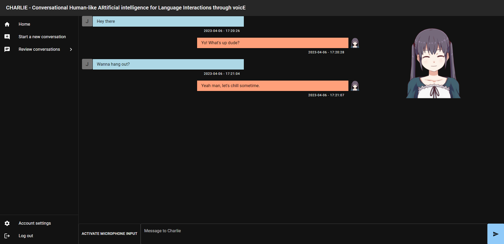
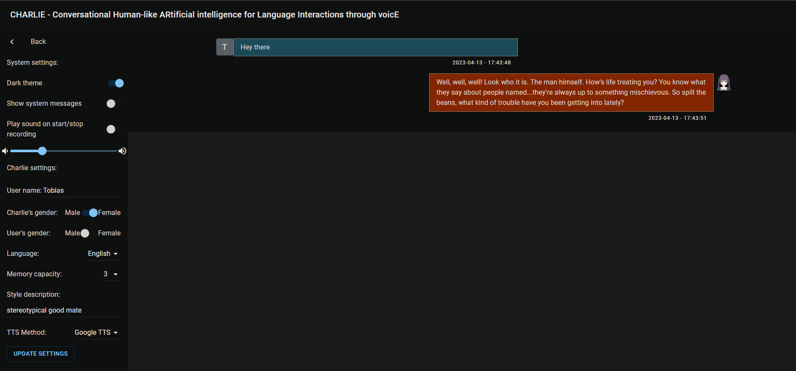

# CHARLIE
stands for: **C**onversational **h**uman-like **ar**tificial intelligence for **l**anguage **i**nteractions through voic**e**

If you want to say thanks or support:

[](https://www.buymeacoffee.com/tobiasm95)


## Features

This project aimed to give ChatGPT ears, eyes, attitude, a face and a voice. You can either talk or text him/her and Charlie will respond. You can also tweak some settings like your name, Charlie's gender and their answer style/character. Since this runs with ChatGPT at the moment there are heavy restrictions on how far you can tweak the behavior of Charlie. Additionally you can review your previous conversations.

This repo can be run locally without the need of special hardware since everything is based on APIs for easier installation and use. I also run this on a private server successfully without too much tweaking. There are also some legacy modes that you can activate for translation tasks and raw ChatGPT inputs but these are not documented and are from very early versions.

The technologies that are in use are the following:

- OpenAI's Whisper API for transcripts of spoken text
- DeepL for translation tasks (mainly in the background and not for the user to interact with)
- OpenAI's ChatGPT API with special prompts to create a minorly configurable chat bot
- Google Cloud TTS for most TTS outputs
- elevenlabs.ai integration if you have an account there or want to use up 10k characters in 15 minutes
- React and Material UI for the frontend
- Flask for the backend
- Live2d Cubism Web SDK for the live2d characters
- Rest APIs and Websockets for the communication between these components

Some screenshots:

Chat preview



Settings and chat review



## Setup

### REQUIREMENTS

This was tested with:
- Windows 10 or Ubuntu 22.04 (with Python 3.9.16 if you want backend only audio, not necessary)
- Python 3.10.1
- Node.js 19.8.1
- npm 9.5.1 (with npx)

You can probably deviate from those versions to some extent but you're at your own in that case. I started this project on Ubuntu, it definitely does run on Linux, some of the libraries were a PAIN to setup though (looking at you `simpleaudio` & `pyaudio`) so they are deactivated currently. You can try to install them if you use the exact setup posted above if you run `./setup_backend.sh --install-backend-audio-unstable-3.9` but they're only use to run the backend without the frontend for pure audio input which might not be supported anymore. In summary, best to ignore them.

Python 3.10.1 is probably not necessary. I don't think I used any super modern python commands. You should be fine with earlier versions. **It is recommended to create a virtual environment for this project before running the backend setup!**

I'm no expert with Node.js and npm. I cannot tell you if any version deviation breaks anything. I could barely make this run on my own system.

**Furthermore**, you need an API Key for OpenAI's API, DeepL's API. Optionally, a Google Cloud Service Account with activated and set up Google Cloud TTS API with the `tts-api-XXXXXX-XXX....XXX.json` key file. Setting up the Google Cloud TTS is a bit more involved but there are enough guides out there to help you out. You can also use elevenlabs.ai and provide your API key.

**IMPORTANT:** There's currently a google login button present. You can configure that with your own credentials or use the skip login button (for more information see https://www.youtube.com/watch?v=roxC8SMs7HU).


### Setup process

1. Clone this repository recursively (see the Framework sub-directory in the live2d directory), e.g. with `git clone --recurse-submodules -j8 git@github.com:TobiasM95/CHARLIE.git`
2. `cd` into the repo
3. Download the Live2D Cubism SDK for Web (at https://www.live2d.com/en/download/cubism-sdk/download-web/ )
4. Extract it and copy the contents of the `Core` directory to the equally named `live2d/Core` direcory inside the CHARLIE repository (you don't need anything else, just the `Core` contents since it is not allowed to redistribute those)
5. (RECOMMENDED) Create and/or activate your python virtual environment
6. Run `setup_backend.bat` (or the `.sh` equivalent if you're on Linux)
7. Run `setup_frontend.bat` (or the `.sh` equivalent if you're on Linux)
8. Run `setup_live2d.bat` (or the `.sh` equivalent if you're on Linux)
9. Create a file called `api_keys.json` inside the `backend` directory and paste the following inside and replace the placeholders (`google` stands for the Google cloud TTS service account which you don't need anymore as well as `elevenlabs-tts` which is now optional too but you still need these placeholders):
```json
{
    "api_keys": {
        "deepl": "YOUR-DEEPL-API-KEY-HERE",
        "openai": "YOUR-OPENAI-API-KEY-HERE",
        "google": "OPTIONAL-THE-NAME-OF-YOUR-GOOGLE-SERVICE-ACCOUNT-KEY-FILE-HERE-OR-LEAVE-PLACEHOLDER-HERE",
        "elevenlabs-tts": "OPTIONAL-YOUR-ELEVENLABS-API-KEY-HERE-OR-LEAVE-PLACEHOLDER-HERE"
    }
}
```
10. OPTIONAL: Inside the file `frontend/src/Settings/gis_client_id.json` enter your GIS client id (check requirements for more information).
11. OPTIONAL: Copy your Google Cloud key file in the `backend` directory


## How to run

To run this you need to start 2 servers: The backend- and frontend-server. The live2d content is served from the Flask backend. You also need free ports 3000 and 5000 on localhost! Open up 2 terminals (or terminal tabs if you live in the 21st century) and perform the steps below:
1. In terminal 1: activate the virtual environment if you created one
2. In terminal 1: `cd` into `frontend` and run `npm run start-api-debug`
3. In terminal 3: `cd` into `frontend` and run `npm run start`
4. React opens the frontend page automatically. If not, you can open CHARLIE at http://localhost:3000


## Note to developers or contributors

[](https://www.buymeacoffee.com/tobiasm95)

Current construction sites:
- Mobile friendly page
- Better ChatGPT prompts for more immersive responses (or replace it completely)
- Improve live2d models and animations

Generally:
- Help is appreciated if it's commits or issues or just spreading the word
- backend is python flask, frontend is React with MUI, live2d is webpack js/ts
- This tool requires API keys for OpenAI, DeepL (free), and optionally Google-TTS (which also needs a service account, which is free) or elevenlabs.ai API key (hella expensive for more than the free tier)